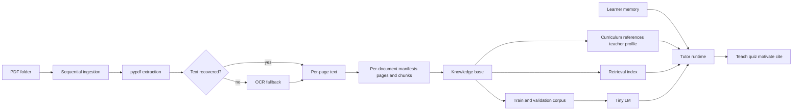

# Architecture

`The Grammar Teacher` is a hybrid tutor. The model provides teaching style and interaction, while the knowledge base and retrieval layer provide grounded content and references.

## Diagram

## Core Layers

- `Ingestion`: reads PDFs one by one and preserves document identity.
- `Extraction`: uses `pypdf` first, then OCR fallback when native extraction fails.
- `Knowledge base`: stores manifests, page text, chunks, references, curriculum, and teacher profile data.
- `Retrieval`: finds the best matching chunk for a learner question.
- `Model`: shapes tone, examples, mini-quizzes, and practice prompts.
- `Memory`: tracks learner level, progress, weak areas, and next suggested topics.

## Curriculum Shape

- `starter`: school texts and very gentle introductions
- `foundation`: parts of speech, sentence basics, and usage
- `core`: high-frequency grammar control
- `intermediate`: bridge material between core grammar and advanced usage
- `advanced`: nuance, deeper explanations, and edge cases
- `teacher`: explanation quality, pedagogy, and error analysis
- `writing`: composition, revision, and style
- `exam`: drills, correction, and timed mixed review

## Runtime Behavior

When a learner asks a question:

1. Classify the request intent.
2. If intent is daily lesson, return a curated grammar lesson card (topic, rule, examples, usage tip, quick check).
3. Otherwise, retrieve the best source chunks for the topic.
4. Pull learner memory and current level.
5. Build explanation points using a synthesis strategy (concept-first, composite segmented, sentence parse, etc).
6. Summarize oversized output and enforce response word limits.
7. Return a friendly answer with a short source reference.

## Output Controls

- Quick checks include:
  - question
  - answer
  - short why explanation
- Explanation points are auto-summarized and bounded by configurable word limits.
- Daily lesson requests rotate through curated topics with persisted state.

## Practical Rule

Do not treat the tiny model as the source of truth. Treat it as the tutoring layer. Facts, references, and topic grounding should come from the processed documents whenever possible.
